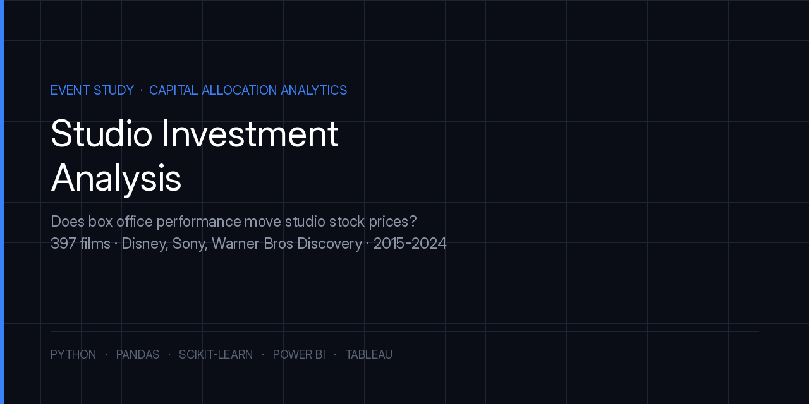
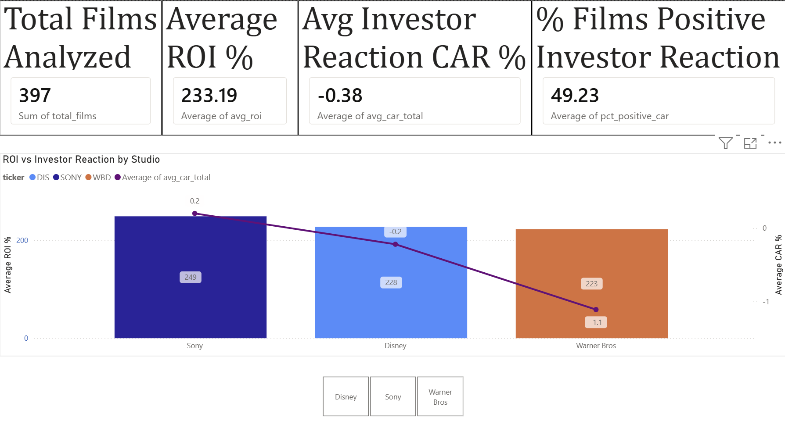
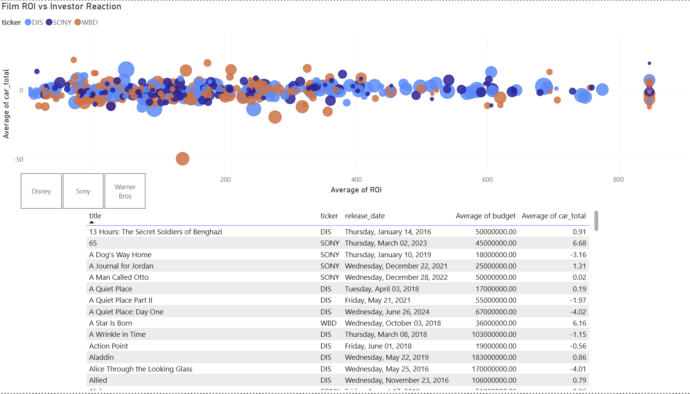
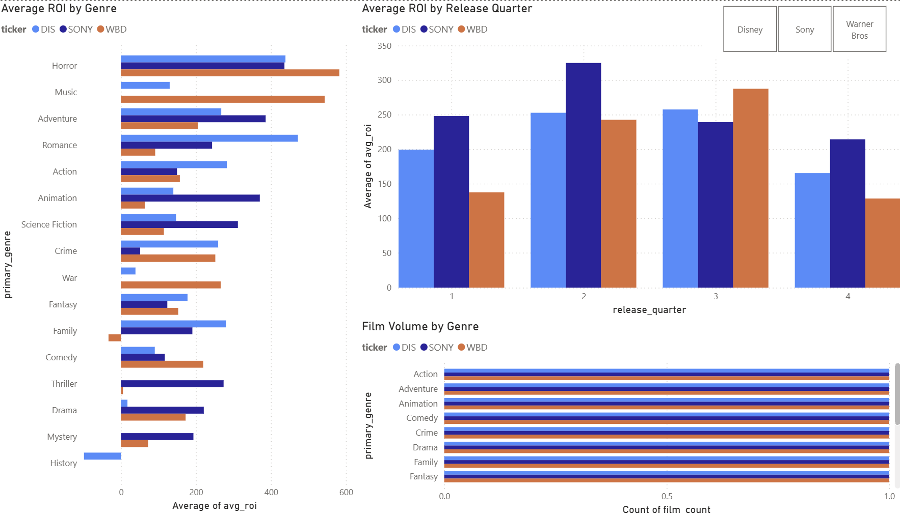
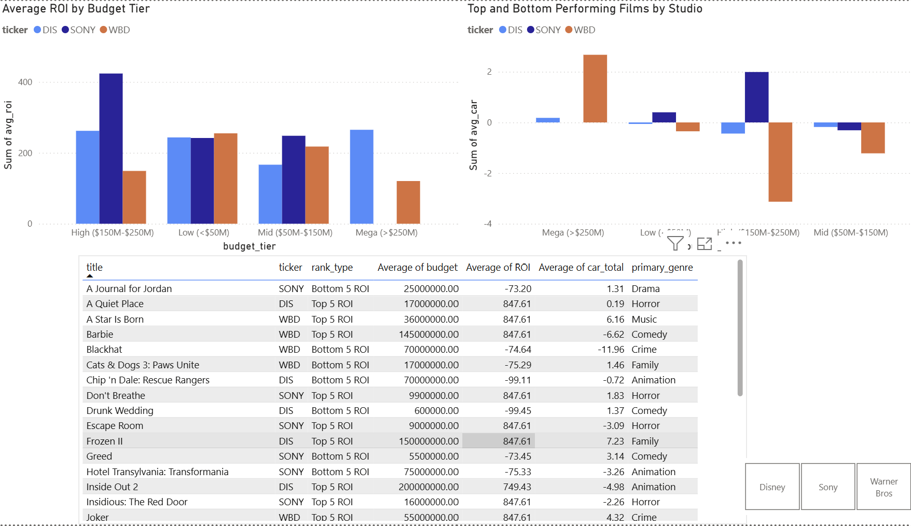
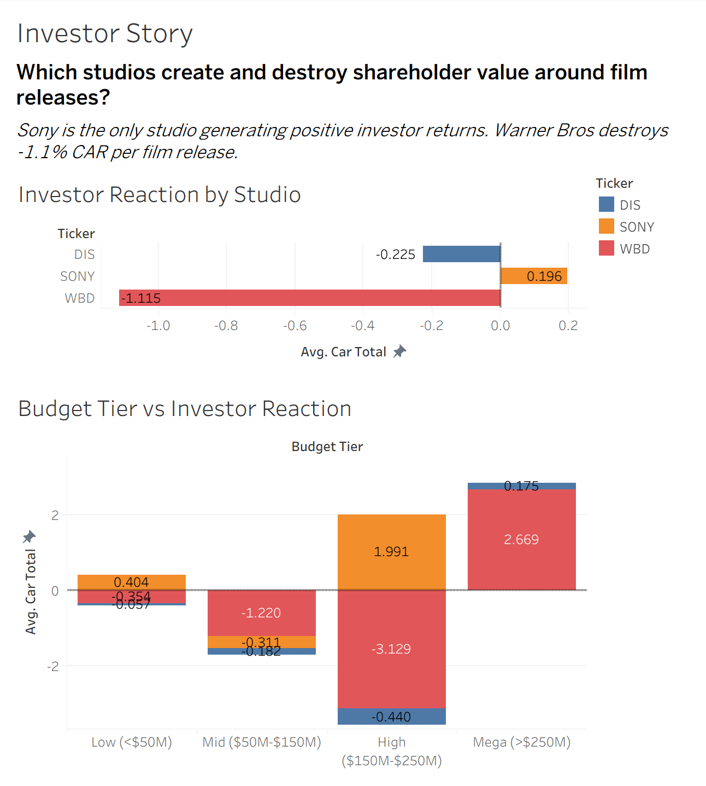
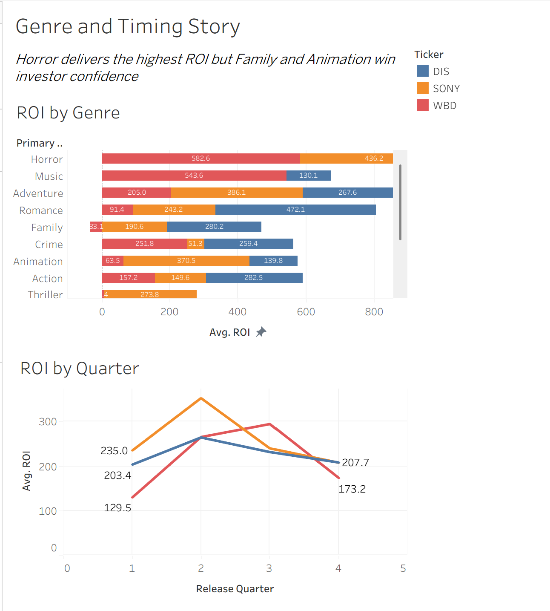
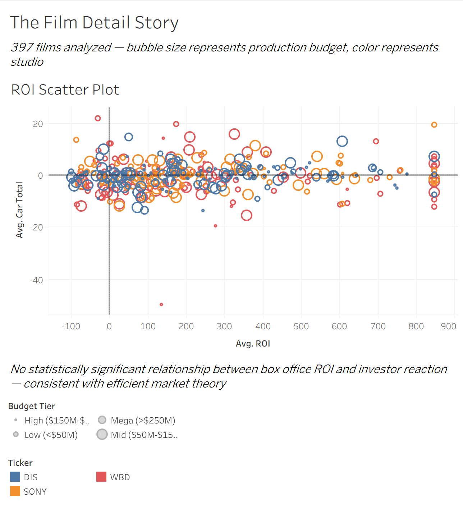

# Studio Investment Analysis: Entertainment Finance & Investor Behavior (2015–2024)



[](https://www.python.org/)
[](https://powerbi.microsoft.com/)
[](https://www.tableau.com/)


> **Does box office performance actually move studio stock prices — and can we predict how investors will react before a film releases?**

This project applies event study methodology from quantitative finance to answer a capital allocation question that entertainment CFOs face every year: are studios investing their film budgets in ways that maximize both box office return and shareholder value?

---

## Project Overview

Major entertainment studios invest hundreds of millions of dollars into individual film productions. These decisions affect not just box office revenue but shareholder confidence, investor sentiment, and long-term brand equity. Yet most studios treat film investment as a creative decision rather than a data-driven one.

This analysis examines **397 films** released by **Disney, Sony Pictures, and Warner Bros Discovery** between **2015 and 2024**, connecting box office financial performance to real stock market reactions using a custom event study framework built from scratch in Python.

---

## Tools & Technologies

| Category | Tools |
|---|---|
| Data Collection | Python, TMDB API, yfinance (Yahoo Finance) |
| Data Cleaning & Engineering | pandas, numpy, json |
| Statistical Analysis | scipy, sklearn |
| Machine Learning | scikit-learn (Linear Regression, Random Forest) |
| Visualization | Power BI (4-page executive dashboard), Tableau (3-dashboard investor story) |
| Environment | Google Colab, Google Drive |

---

## Dataset

### Source 1 — Film Data (TMDB API)
- **Source:** The Movie Database API (primary data collection via live API calls — not a pre-built dataset)
- **Films:** 397 English-language theatrical releases with complete financial data
- **Date range:** January 2015 – December 2024
- **Studios covered:** Disney (DIS), Sony Pictures (SONY), Warner Bros Discovery (WBD)
- **Key fields:** Title, release date, production budget, worldwide box office revenue, genre, production companies, audience rating, vote count

### Source 2 — Stock Price Data (Yahoo Finance)
- **Source:** Yahoo Finance via yfinance Python library
- **Tickers:** DIS, SONY, WBD, ^GSPC (S&P 500 benchmark)
- **Trading days:** 2,514 daily records from January 2, 2015 to December 30, 2024
- **Key fields:** Daily open, close, high, low, volume — adjusted for splits and dividends

### Master Dataset (Engineered)
The two datasets were joined through a custom time-based event study framework, producing one row per film containing both financial performance metrics and stock market reaction metrics. This dataset did not exist before this project — it was built entirely through the data engineering process described below.

---

## Data Engineering & Cleaning

### Film Data Cleaning
The TMDB API returns production companies as nested JSON strings. Studio names required two-pass extraction and standardization:

**Pass 1 — Primary studio extraction:**
```python
def extract_primary_studio(company_str):
    companies = json.loads(company_str.replace("'", '"'))
    return companies[0]['name'] if companies else None
```

**Pass 2 — Entity resolution (fuzzy matching):**
Studio subsidiary names were mapped to parent company tickers. For example:
- `Walt Disney Pictures`, `Marvel Studios`, `Pixar`, `Lucasfilm`, `Walt Disney Animation Studios` → `DIS`
- `Columbia Pictures`, `TriStar Pictures`, `Screen Gems`, `Sony Pictures Animation` → `SONY`
- `Warner Bros. Pictures`, `DC Films`, `New Line Cinema`, `Castle Rock Entertainment` → `WBD`

**Key cleaning decisions documented:**
- 1,574 films removed due to zero budget or revenue (unreported data, not true zeros)
- Films with fewer than 10 TMDB audience votes excluded (insufficient rating validity)
- ROI outliers capped using IQR method: lower bound -455%, upper bound +824% (winsorization)
- Release dates converted from string to datetime for trading day alignment

### Stock Data Engineering
**Abnormal Return Calculation:**
Raw stock price movement was adjusted for market-wide performance using the S&P 500 as a benchmark:

```
Abnormal Return = Studio Daily Return − S&P 500 Daily Return
```

This isolates studio-specific price movement from broader market noise — the same methodology used by academic finance researchers and equity analysts.

**Event Window Construction:**
For each film release, a ±5 trading day window was built around the nearest trading day after release (films release Friday; markets open Monday):

```python
def get_event_window(release_date, ticker, window_size=5):
    future_days = [d for d in trading_days if d >= release_dt]
    nearest = future_days[0]
    idx = trading_days.index(nearest)
    window_days = trading_days[idx - window_size : idx + window_size + 1]
    return window_days
```

**Cumulative Abnormal Return (CAR) metrics engineered:**
- `car_total` — sum of abnormal returns across full 11-day event window
- `car_pre_release` — abnormal returns in 5 days BEFORE release (anticipation signal)
- `car_post_release` — abnormal returns in 5 days AFTER release (opening weekend reaction)
- `car_day_of_release` — single-day reaction on first trading day after release

---

## Key Findings

### Finding 1 — Sony is the only studio generating positive average investor reaction
| Studio | Films | Avg ROI | Avg CAR | % Positive CAR |
|---|---|---|---|---|
| Disney | 149 | 228% | -0.22% | 47.7% |
| Sony | 108 | 249% | +0.20% | 56.5% |
| Warner Bros | 140 | 223% | -1.11% | 43.6% |

Sony generates positive investor reactions on 56.5% of releases — the only studio where the majority of films move the stock in a positive direction. Warner Bros destroys an average of -1.11% cumulative abnormal return per film release.

### Finding 2 — Box office ROI does not predict investor reaction
Correlation analysis across all three studios found no statistically significant relationship between a film's ROI and its CAR:

| Studio | R² | P-value | Interpretation |
|---|---|---|---|
| Disney | 0.013 | 0.164 | Not significant |
| Sony | 0.022 | 0.124 | Not significant |
| Warner Bros | 0.000 | 0.954 | Not significant |

This is consistent with semi-strong form Efficient Market Hypothesis — all publicly available information about a film (budget, franchise history, tracking data) is already priced into the stock before opening weekend. Only the surprise component matters, not raw performance.

### Finding 3 — Warner Bros high-budget films destroy the most shareholder value
| Budget Tier | Disney CAR | Sony CAR | Warner Bros CAR |
|---|---|---|---|
| Low (<$50M) | -0.06% | +0.40% | -0.35% |
| Mid ($50M–$150M) | -0.18% | -0.31% | -1.22% |
| High ($150M–$250M) | -0.44% | +1.99% | -3.13% |
| Mega (>$250M) | +0.18% | N/A | +2.67% |

Warner Bros' High budget tier ($150M–$250M) generates an average CAR of -3.13% — the worst studio-tier combination in the entire dataset. These are primarily DC franchise films that consistently underperform elevated investor expectations.

### Finding 4 — Q4 is the only release window generating positive investor sentiment
| Quarter | Avg ROI | Avg CAR | Film Count |
|---|---|---|---|
| Q1 (Jan–Mar) | 188% | -0.80% | 90 |
| Q2 (Apr–Jun) | 282% | -0.39% | 99 |
| Q3 (Jul–Sep) | 260% | -1.33% | 98 |
| Q4 (Oct–Dec) | 198% | +0.66% | 110 |

Summer releases (Q3) generate the worst investor reaction despite solid ROI — elevated expectations lead to consistent disappointment. Q4 is the only quarter where average investor sentiment is positive.

### Finding 5 — Horror is highest ROI but Family/Animation win investor confidence
| Genre | Avg ROI | Avg CAR | Film Count |
|---|---|---|---|
| Horror | 489% | -0.17% | 45 |
| Family | 224% | +1.53% | 16 |
| Animation | 208% | +1.01% | 27 |
| Action | 200% | -1.15% | 104 |

Horror films generate the highest ROI (489%) but barely register investor reaction because the absolute dollar amounts are small. Family and Animation content generates the strongest positive investor sentiment. Action films — the most produced genre at 104 films — consistently disappoint investors.

---

## Predictive Model — Greenlight Decision Tool

A predictive model was built to test whether pre-release film characteristics could predict investor reaction. Two models were trained on features available before a film releases: budget, release quarter, studio, genre, and budget tier.

| Model | R² (Test) | R² (CV) | MAE |
|---|---|---|---|
| Linear Regression | 0.031 | -0.055 | 3.75% |
| Random Forest | -0.057 | -0.659 | 4.11% |

**Interpretation:** Negative cross-validation scores confirm that pre-release characteristics alone are insufficient to predict stock market reaction — consistent with efficient market theory. However, feature importance analysis revealed budget size (56.9%) and release quarter (18.0%) as the strongest drivers of investor response, even if the overall signal is weak.

The model was deployed as a greenlight decision support tool. Example outputs:

| Proposed Film | Studio | Budget | Quarter | Predicted CAR | Decision |
|---|---|---|---|---|---|
| Horror film | SONY | $20M | Q4 | +4.07% | ✓ Greenlight |
| Animated sequel | DIS | $150M | Q4 | +0.18% | ✓ Greenlight |
| Action blockbuster | WBD | $200M | Q3 | -1.62% | ✗ Reconsider |
| DC film | WBD | $250M | Q2 | -2.11% | ✗ Reconsider |

---

## Business Recommendations

**1. Warner Bros: Cap non-franchise budgets at $50M**
WBD's $150M–$250M films generate -3.13% CAR — the worst studio-tier combination in the dataset. Unless a property has proven franchise demand, WBD should avoid the high-budget tier where investor expectations consistently exceed performance.

**2. Disney: Protect and expand the mega-budget franchise slate**
Disney's >$250M films generate +0.18% CAR and 265% average ROI simultaneously — the only tier where both metrics are simultaneously positive. The data supports continued concentration in Marvel and Star Wars tentpoles.

**3. Sony: Protect the low-budget horror and thriller slate**
Sony's <$50M films generate +0.40% CAR and 242% ROI — their strongest combination. Sony should resist pressure to compete with Disney on mega-budget productions where they have no franchise infrastructure.

**4. All Studios: Shift prestige releases from Q3 to Q4**
Q3 generates -1.33% average CAR — the worst investor sentiment of any quarter. Q4 generates +0.66%. Studios should avoid releasing high-expectation films in the summer window where market disappointment is structurally most likely.

---

## Dashboard Previews

### Power BI — Executive Dashboard (4 Pages)

**Page 1 — Studio Scorecard**


**Page 2 — Film Performance**


**Page 3 — Genre and Timing**


**Page 4 — Budget Analysis**


### Tableau — Investor Story (3 Dashboards)

**Dashboard 1 — Investor Story**


**Dashboard 2 — Genre and Timing Story**


**Dashboard 3 — Film Detail Story**


---

## Project Structure

```
studio-investment-analysis/
│
├── data/
│   ├── dashboard_master.csv          # 397 films with ROI and CAR metrics
│   ├── dashboard_studio_summary.csv  # Studio-level KPIs
│   ├── dashboard_budget_tiers.csv    # Budget tier analysis
│   ├── dashboard_genres.csv          # Genre performance
│   ├── dashboard_timing.csv          # Release timing by year and quarter
│   ├── dashboard_annual.csv          # Year-by-year studio performance
│   ├── dashboard_top_bottom.csv      # Top and bottom 5 films per studio
│   └── dashboard_stock_prices.csv    # Daily stock prices 2015-2024
│
├── notebooks/
│   └── studio_investment_analysis.ipynb  # Full Python analysis
│
├── images/
│   └── [dashboard screenshots]
│
├── dashboards/
│   └── Studio_Investment_Analysis.pbix   # Power BI file
│
└── README.md
```

---

## Methodology Note

This project applies **event study methodology** — a standard technique in academic finance used to measure the impact of specific corporate events on stock prices. By calculating Cumulative Abnormal Returns (CAR) around film release dates and subtracting market-wide S&P 500 performance, we isolate the studio-specific investor reaction from broader market noise.

The approach is consistent with semi-strong form Efficient Market Hypothesis research and mirrors methods used by equity analysts at investment banks when evaluating how content performance affects media company valuations.

---

## About

Built by Tanya | MS Business Analytics Candidate — Simon Business School, University of Rochester (December 2026)

Targeting business analyst and data analytics roles in entertainment, beauty, luxury, retail, and CPG industries.

[LinkedIn](https://www.linkedin.com/in/tanyapatel23/) | [Email](mailto:tpatel18@simon.rochester.edu)
